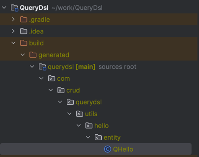

# Spring-QueryDsl

## 1. QueryDSL 설정 (현재 3.1.2 사용중)

---
### 스프링 부트 2.6 ~ 2.7에서 build.gradle 설정
```java
// (1) queryDSL 추가
buildscript {
	ext {
		queryDslVersion = "5.0.0"
	}
}

plugins {
	id 'java'
	id 'org.springframework.boot' version '2.7.7'
	id 'io.spring.dependency-management' version '1.0.15.RELEASE'
	// (2) queryDSL 추가
	id "com.ewerk.gradle.plugins.querydsl" version "1.0.10"
}

group = 'study'
version = '0.0.1-SNAPSHOT'
sourceCompatibility = '11'

configurations {
	compileOnly {
		extendsFrom annotationProcessor
	}
}

repositories {
	mavenCentral()
}

dependencies {
	implementation 'org.springframework.boot:spring-boot-starter-data-jpa'
	implementation 'org.springframework.boot:spring-boot-starter-web'

	// (3) queryDSL 추가
	implementation "com.querydsl:querydsl-jpa:${queryDslVersion}"
	annotationProcessor "com.querydsl:querydsl-apt:${queryDslVersion}"

	compileOnly 'org.projectlombok:lombok'
	runtimeOnly 'com.h2database:h2'
	annotationProcessor 'org.projectlombok:lombok'

	testCompileOnly 'org.projectlombok:lombok'
	testAnnotationProcessor 'org.projectlombok:lombok'
	testImplementation 'org.springframework.boot:spring-boot-starter-test'
}

tasks.named('test') {
	useJUnitPlatform()
}

// (4) queryDSL 추가 : QueryDSL 빌드 옵션
def querydslDir = "$buildDir/generated/querydsl"

querydsl {
	jpa = true
	querydslSourcesDir = querydslDir
}
sourceSets {
	main.java.srcDir querydslDir
}
configurations {
	querydsl.extendsFrom compileClasspath
}
compileQuerydsl {
	options.annotationProcessorPath = configurations.querydsl
}
// 여기까지
```


---

### 스프링 부트 3.0에서 build.gradle 설정
```java
plugins {
    id 'java'
    id 'org.springframework.boot' version '3.1.2'
    id 'io.spring.dependency-management' version '1.1.2'

    //  queryDsl
    id "com.ewerk.gradle.plugins.querydsl" version "1.0.10"
}


group = 'com.crud'
version = '0.0.1-SNAPSHOT'

java {
    sourceCompatibility = '17'
}

configurations {
    compileOnly {
        extendsFrom annotationProcessor
    }
}

repositories {
    mavenCentral()
}

dependencies {
    implementation 'org.springframework.boot:spring-boot-starter-data-jpa'
    implementation 'org.springframework.boot:spring-boot-starter-security'
    implementation 'org.springframework.boot:spring-boot-starter-thymeleaf'
    implementation 'org.springframework.boot:spring-boot-starter-web'
    implementation 'org.thymeleaf.extras:thymeleaf-extras-springsecurity6'
    compileOnly 'org.projectlombok:lombok'
    developmentOnly 'org.springframework.boot:spring-boot-devtools'
    runtimeOnly 'com.h2database:h2'
    annotationProcessor 'org.projectlombok:lombok'
    testImplementation 'org.springframework.boot:spring-boot-starter-test'
    testImplementation 'org.springframework.security:spring-security-test'

    // Querydsl 추가
    implementation 'com.querydsl:querydsl-jpa:5.0.0:jakarta'
    annotationProcessor "com.querydsl:querydsl-apt:${dependencyManagement.importedProperties['querydsl.version']}:jakarta"
    annotationProcessor "jakarta.annotation:jakarta.annotation-api"
    annotationProcessor "jakarta.persistence:jakarta.persistence-api"
}

tasks.named('test') {
    useJUnitPlatform()
}

// queryDSL 추가 : QueryDSL 빌드 옵션
def querydslDir = "$buildDir/generated/querydsl"

querydsl {
    jpa = true
    querydslSourcesDir = querydslDir
}
sourceSets {
    main.java.srcDir querydslDir
}
configurations {
    querydsl.extendsFrom compileClasspath
}
compileQuerydsl {
    options.annotationProcessorPath = configurations.querydsl
}

```

---
## 2. 환경설정 테스트
```java
@Entity
@Getter
@Setter
public class Hello {

    @Id
    @GeneratedValue
    private Long id;
}

```

### 검증용 테스트 Q타입 생성

- Gradle -> Tasks -> others -> complieQuerydsl
  - build/generated/{프로젝트명}
  - build/generated/querydsl/com/crud/querydsl/utils/hello/entity/QHello.java



----

## 3. 테스트코드
```java
@SpringBootTest
@Transactional
class QuerydslBasicTestTest {


    @Autowired
    EntityManager em;
    JPAQueryFactory queryFactory;

    @BeforeEach
    public void before() {
        queryFactory = new JPAQueryFactory(em);
        Team teamA = new Team("teamA");
        Team teamB = new Team("teamB");
        em.persist(teamA);
        em.persist(teamB);

        Member member1 = new Member("member1", 10, teamA);
        Member member2 = new Member("member2", 20, teamA);

        Member member3 = new Member("member3", 20, teamB);
        Member member4 = new Member("member4", 20, teamB);

        em.persist(member1);
        em.persist(member2);
        em.persist(member3);
        em.persist(member4);

    }

    @Test
    public void startQuerydsl() {

        // username : member1
        Member username = queryFactory
            .select(member)
            .from(member)
            .where(member.username.eq("member1"))
            .fetchOne();

        assertThat(username.getUsername()).isEqualTo("member1");
    }
}
```

> 쿼리 완성 후 결과 조회 시에는 다음과 같은 메서드 들을 이용 가능
- fetch() : 리스트 조회, 데이터 없으면 빈 리스트 반환
  - fetchOne() : 단 건 조회, 결과 없으면 null, 2개 이상이라면 NonUniqueResultException
- fetchFirst() : 첫 번째 결과 조회
- fetchResults() : 페이징 정보 포함 및 totalCount 쿼리를 추가 실행
- fetchCount() : count 쿼리로 변경해서 count 수를 조회 할 수 있다